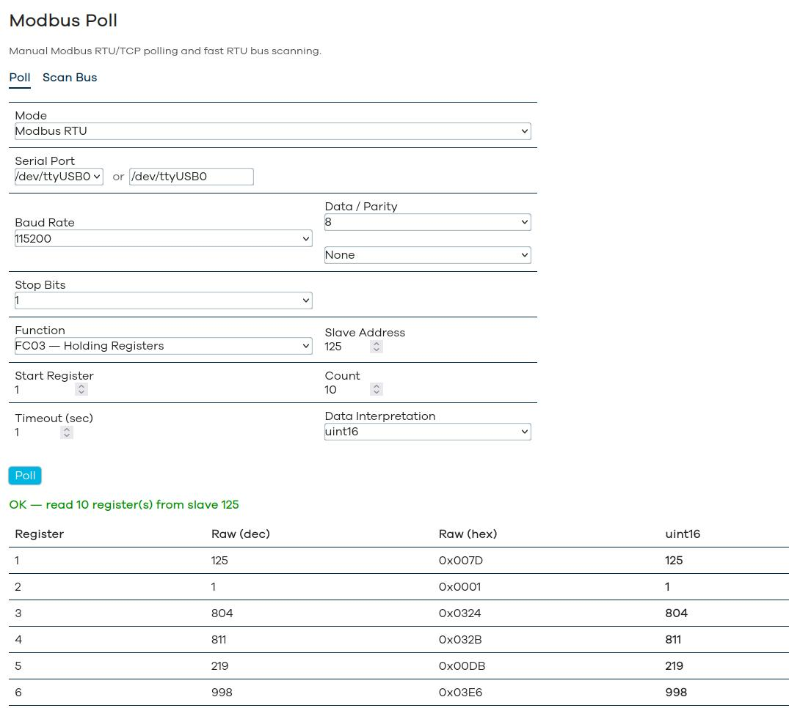
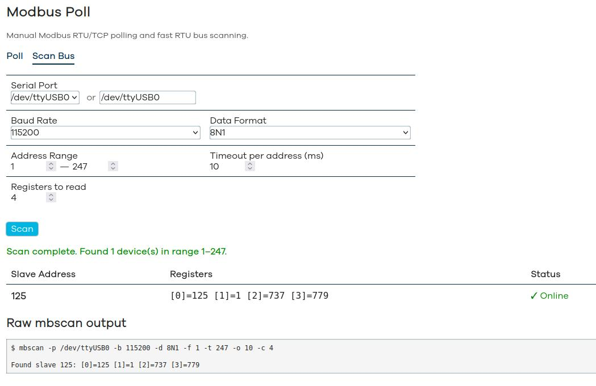

# luci-app-mbpoll — Modbus Poll & Scan for LuCI

Web interface for manual Modbus device polling and RTU bus scanning on OpenWrt.

Poll


Scan    


## Features

### Poll Tab
- **Modbus RTU and TCP** — switch between serial and network modes
- **FC03** (Read Holding Registers) and **FC04** (Read Input Registers)
- Serial port auto-detection + manual input
- Full serial configuration: baud rate, data bits, parity, stop bits
- TCP mode: host + port (default 502)
- Configurable register range, slave address, timeout
- **Data type interpretation**: uint16, int16, uint32, int32, float32 (AB CD and CD AB word order)
- Results table: register address, raw decimal, raw hex, interpreted value
- Raw `mbpoll` output for debugging

### Scan Bus Tab
- **Fast RTU bus scanning** via [mbscan](https://github.com/lab240/mbscan) (C utility)
- Full scan of 247 addresses in ~2.5 seconds (at 10ms timeout)
- Configurable: port, baud, data format (8N1/8E1/...), address range, timeout, register count
- Results table with slave addresses, register values, online status
- Raw `mbscan` output for debugging

## Requirements

- OpenWrt with LuCI
- [`mbpoll`](https://github.com/epsilonrt/mbpoll) — Modbus master CLI tool (available in OpenWrt packages)
- [`mbscan`](https://github.com/lab240/mbscan) — fast Modbus RTU bus scanner

Both dependencies are declared in the package Makefile and will be installed automatically.

## Installation

### From OpenWrt Build System

Copy into your OpenWrt package tree:

```bash
cp -r luci-app-mbpoll /path/to/openwrt/package/
```

Add to `.config`:

```bash
echo "CONFIG_PACKAGE_luci-app-mbpoll=y" >> .config
```

Build:

```bash
make package/luci-app-mbpoll/compile -j$(nproc)
```

### Manual Install on Running System

Copy files directly:

```bash
scp htdocs/luci-static/resources/view/mbpoll.js root@<IP>:/www/luci-static/resources/view/
scp root/usr/share/luci/menu.d/luci-app-mbpoll.json root@<IP>:/usr/share/luci/menu.d/
scp root/usr/share/rpcd/acl.d/luci-app-mbpoll.json root@<IP>:/usr/share/rpcd/acl.d/

ssh root@<IP> "/etc/init.d/rpcd restart"
```

Make sure `mbpoll` and `mbscan` are installed on the device.

## Package Structure

```
luci-app-mbpoll/
├── Makefile                                    # OpenWrt package Makefile
├── htdocs/luci-static/resources/view/
│   └── mbpoll.js                               # LuCI JS view (Poll + Scan tabs)
└── root/usr/share/
    ├── luci/menu.d/
    │   └── luci-app-mbpoll.json                # Menu entry (Services → Modbus Poll)
    └── rpcd/acl.d/
        └── luci-app-mbpoll.json                # ACL permissions
```

## Defaults

| Parameter | Poll Tab | Scan Tab |
|---|---|---|
| Baud rate | 115200 | 115200 |
| Data format | 8N1 | 8N1 |
| Slave address | 1 | 1–247 |
| Timeout | 1 sec | 50 ms |
| Start register | 1 (mbpoll, 1-based) | 0 (mbscan, 0-based) |

## Hardware

Developed for and tested on [NapiLab Napi](https://napiworld.ru) industrial IoT gateways (Rockchip RK3308, OpenWrt). Works on any OpenWrt device with serial ports or USB-Serial adapters.

## Related Projects

- [mbscan](https://github.com/lab240/mbscan) — fast Modbus RTU bus scanner (C)
- [luci-app-mbusd](https://github.com/lab240/napi-openwrt-build) — LuCI interface for mbusd Modbus gateway
- [napi-openwrt-build](https://github.com/lab240/napi-openwrt-build) — OpenWrt build for NapiLab Napi

## License

GPL-2.0
